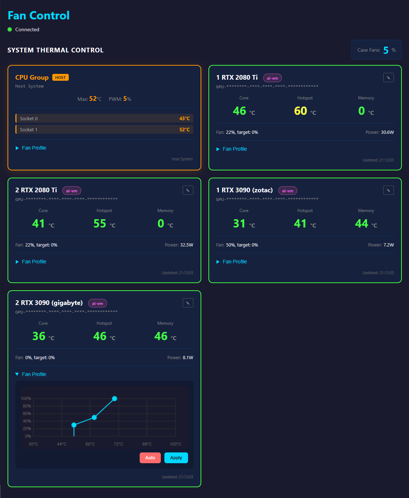

# Box Fan Control for CPU and GPU v3

Система управления вентиляторами для сервера Proxmox с GPU passthrough в виртуальные машины.  
Проект является продолжением [box_fan_control_for_cpu_and_gpu](https://github.com/AlexanderChad/box_fan_control_for_cpu_and_gpu)  

> [!WARNING]
> <details>
> <summary><strong>Проект разработан с использованием ИИ</strong></summary>
>
> Часть кода была сгенерирована или оптимизирована нейросетями.  
> Из-за большого объема проекта не все участки могли пройти полное ручное ревью, поэтому в коде могут встречаться следующие особенности:
>
> *   **Лишний код:** наличие неиспользуемых функций, переменных или лишних импортов.
> *   **Неточности в комментариях:** описания могут не на 100% соответствовать текущей логике из-за склонности ИИ к «галлюцинациям» в пояснениях и забывании обновить их после изменения кода.
> *   **Избыточность и дублирование:** создание похожих функций в разных частях вместо единой абстракции.
> *   **Безопасность и уязвимости:** возможные пропуски в проверке входных данных (Input Validation) или использование не самых актуальных зависимостей.
> *   **Логические галлюцинации:** код может выглядеть рабочим, но выдавать некорректные результаты в пограничных сценариях (edge cases).
> *   **Проблемы производительности:** наличие неоптимальных циклов или избыточных операций.
> *   **Архитектурный долг:** ИИ часто решает локальные задачи «в лоб», что может усложнять общую архитектуру и дальнейшую поддержку.
>
> Пожалуйста, используйте проект с осторожностью и проводите самостоятельный аудит перед использованием.
> </details>

## Функционал

- **Централизованное управление** — хост управляет всеми корпусными вентиляторами на основе температур CPU и GPU
- **GPU Passthrough** — GPU могут быть проброшены в ВМ, система получает телеметрию по WebSocket
- **Динамическая идентификация** — автоматическое сопоставление GPU по UUID и PCI адресам
- **Веб-интерфейс** — мониторинг и настройка профилей в реальном времени
- **Netdata интеграция** — метрики через StatsD для визуализации
- **Emergency режим** — автоматическое включение 100% вентиляторов при потере связи с GPU в запущенной ВМ



## Архитектура

```
┌─────────────────────────────────────────────────────────────────────┐
│                          HOST (Proxmox)                             │
│  ┌───────────────────────────────────────────────────────────────┐  │
│  │  FastAPI Server (server.py)                                   │  │
│  │  ├── WebSocket /ws/vm  ← телеметрия от ВМ                     │  │
│  │  ├── WebSocket /ws/ui  ← веб-интерфейс                        │  │
│  │  └── REST API /config, /health                                │  │
│  │                                                               │  │
│  │  Компоненты:                                                  │  │
│  │  ├── StateManager    → реестр GPU, профили, состояние         │  │
│  │  ├── PwmController   → управление корпусными вентиляторами    │  │
│  │  ├── CpuTempReader   → температуры CPU по сокетам             │  │
│  │  ├── ProxmoxMonitor  → статусы ВМ, PCI-маппинг                │  │
│  │  └── StatsDExporter  → метрики для Netdata                    │  │
│  └───────────────────────────────────────────────────────────────┘  │
│                                                                     │
│  config.json ← единый файл конфигурации                             │
│  /etc/pve/qemu-server/*.conf ← конфигурации ВМ Proxmox              │
└─────────────────────────────────────────────────────────────────────┘
                              │
                        WebSocket
                              │
          ┌───────────────────┴───────────────────┐
          │                                       │
          ▼                                       ▼
┌──────────────────────────────┐        ┌──────────────────────────────┐
│  VM (Windows)                │        │  VM (Linux)                  │
│                              │        │                              │
│ fanc_client.py               │        │ fanc_client.py               │
│ - NVML: UUID, PCI, temps     │        │ - NVML: UUID, PCI, temps     │
│ - LibreHardwareMonitor: temps│        │ - pyngjvt: hotspot/VRAM      │
│ - Fan control by profile     │        │ - Fan control by profile     │
└──────────────────────────────┘        └──────────────────────────────┘
```

## Структура проекта

```
host/
├── main.py              # Entry point, запуск сервера
├── server.py            # FastAPI приложение, WebSocket routes
├── config.py            # Константы (таймауты, порты, пути)
├── state.py             # StateManager — реестр GPU, профили, broadcast
├── pwm_controller.py    # Управление PWM через /sys/class/hwmon
├── cpu_reader.py        # Чтение температур CPU из /sys/class/thermal
├── proxmox_monitor.py   # Парсинг конфигов ВМ, qm list
├── statsd_exporter.py   # Отправка метрик в StatsD
├── static/app.js        # Web UI клиент
├── templates/index.html # Web UI шаблон
├── config.example.json  # Пример конфигурации
└── requirements.txt

client/
├── fanc_client.py       # Клиент для ВМ (Windows/Linux)
├── pyngjvt.py           # Чтение hotspot/VRAM temps (Linux)
└── LibreHardwareMonitorLib.dll  # + другие DLLs для Windows
```

## Модули хоста

### server.py
FastAPI приложение с WebSocket endpoints:
- `/ws/vm` — подключение клиентов ВМ, приём телеметрии, отправка профилей
- `/ws/ui` — подключение веб-интерфейса, broadcast состояния
- `/config` — REST API для конфигурации
- `/health` — health check endpoint

### state.py (StateManager)
Центральное хранилище состояния:
- **gpu_config** — конфигурация GPU: `{uuid: {name, host_pci, fan_profile}}`
- **gpu_runtime** — телеметрия в реальном времени
- **Регистрация GPU** — сопоставление UUID ↔ PCI ↔ VM
- **Emergency check** — детект потери связи с GPU в running VM

### pwm_controller.py
Управление корпусными вентиляторами:
- Чтение/запись PWM через `/sys/class/hwmon/`
- Расчёт PWM по профилю (3 точки с интерполяцией)
- Emergency режим: 100% PWM

### proxmox_monitor.py
Интеграция с Proxmox:
- Парсинг `/etc/pve/qemu-server/*.conf` → hostpci → VM ID
- Выполнение `qm list` → статусы ВМ
- Маппинг: `host_pci → vm_id`, `uuid → vm_id`

## Идентификация GPU

Динамическая идентификация при подключении ВМ:

```
1. VM client → server: {type: "init", gpus: [{uuid, pci_in_vm, name}]}
2. Server: pci_in_vm → bus number → hostpci index
3. Server: Proxmox config → host_pci для этого hostpci index
4. Server: регистрация uuid → host_pci
5. Server → VM client: {type: "profiles", profiles: {uuid: [...]}}
```

**Пример:**
- VM отправляет `pci_in_vm = "0000:01:00.0"` (bus=1)
- Server вычисляет `hostpci_index = bus - 1 = 0` (сдвиг из-за Virtio GPU)
- Server находит в конфиге ВМ: `hostpci0 = 0000:0a:00.0`
- Регистрация: `uuid → host_pci = 0000:0a:00.0`

## Конфигурация

### config.json (создаётся автоматически)

```json
{
  "gpus": {
    "GPU-xxxxxxxx-xxxx-xxxx-xxxx-xxxxxxxxxxxx": {
      "name": "RTX 3090 (белая)",
      "host_pci": "0000:0a:00.0",
      "fan_profile": [[50, 30], [70, 70], [85, 100]]
    }
  },
  "cpu_fan_profile": [[50, 50], [65, 80], [75, 100]]
}
```

**Поля:**
- `name` — отображаемое имя (редактируется в UI)
- `host_pci` — PCI адрес на хосте (автообновляется)
- `fan_profile` — 3 точки [temp°C, pwm%] или `[]` для auto
- `cpu_fan_profile` — корпусные вентиляторы по max температуре CPU  
Итоговый PWM = max(cpu_pwm, gpu_pwm)

### config.py (константы)

```python
DATA_TIMEOUT_SECONDS = 5      # Время без телеметрии → emergency
STATSD_HOST = "127.0.0.1"     # StatsD для Netdata
STATSD_PORT = 8125
SERVER_PORT = 17006
```

## Клиент ВМ

### fanc_client.py

```python
# Конфигурация в начале файла
SERVER_URL = "ws://192.168.10.1:17006/ws/vm"
POLL_INTERVAL = 2.0           # Интервал отправки телеметрии
EMERGENCY_TIMEOUT = 5.0       # Таймаут → 100% вентиляторы локально
RECONNECT_DELAY = 3.0         # Интервал переподключения
```

**Функции:**
- Автоподключение с реконнектом при потере связи
- Ping/pong для детекта "зомби" соединений
- Emergency режим локально при потере сервера
- Кроссплатформенность: Windows (LibreHardwareMonitor), Linux (pyngjvt)

### Требования Linux
- [pyngjvt](https://github.com/AlexanderChad/ngjvt) для получения hotspot/VRAM температур
- `iomem=relaxed` в GRUB CMDLINE
- Отключённый Secure Boot
- Root/sudo для доступа к `/dev/mem`

### Требования Windows
- [LibreHardwareMonitorLib.dll (+ зависимости)](https://github.com/LibreHardwareMonitor/LibreHardwareMonitor/releases) для получения hotspot/VRAM температур. 
Нужно: LibreHardwareMonitorLib.dll, System.Memory.dll, System.Numerics.Vectors.dll, System.Runtime.CompilerServices.Unsafe.dll

## Web UI

Доступ: `http://IP-хоста:17006/`

### Возможности
- **System Thermal Control** — общий PWM корпусных вентиляторов
- **Emergency Banner** — красный баннер при аварии
- **CPU Group** — температуры по сокетам + профиль вентиляторов
- **GPU Cards** — детальная информация:
  - Статус: FREE / VM name (running/stopped) / OFFLINE
  - Температуры: Core, Hotspot, Memory
  - Fan %, Power W
  - Индивидуальный профиль вентилятора GPU

### Редактирование профилей
- 3 точки, перетаскивание мышью или touch
- Отображение координат при drag: "55°C - 60%"
- Подтверждение при Apply/Auto
- Автосохранение в config.json

## Emergency Mode

**Условия активации (100% PWM):**
1. ВМ запущена (`qm list` → status=running)
2. GPU проброшен в ВМ (hostpci в конфиге)
3. Нет телеметрии от GPU более 5 секунд

**Реакция:**
- Хост: 100% PWM на корпусные вентиляторы
- Клиент ВМ: 100% на вентиляторы GPU (при потере сервера)
- UI: красный баннер, карточки GPU подсвечиваются красным

## Netdata Integration

Метрики отправляются через StatsD (порт 8125):

```
gpu_<uuid_short>_temp_core:65|g
gpu_<uuid_short>_temp_hotspot:72|g
gpu_<uuid_short>_temp_memory:68|g
gpu_<uuid_short>_fan_percent:45|g
gpu_<uuid_short>_power_watts:250|g
cpu_max_temp:55|g
gpu_group_max_temp:68|g
box_fan_pwm_percent:85|g
```

---

## Установка

Для простоты массовой установки рекомендую устанавливать так:  
- Клонировать репозиторий в сетевую (общую для ВМ) папку
- Скачать библиотеки получения hotspot/VRAM температур (LibreHardwareMonitorLib и pyngjvt)
- Добавить в папку `client` зависимости (LibreHardwareMonitorLib и pyngjvt)
- Настроить fanc_client.py и config.py, config.json
- Копировать с полученной папки (репозитория) уже настроенные наборы в хост/ВМ

### Подготовка клиента (общее для всех ВМ)

**Важно:** Перед копированием клиента на виртуальные машины отредактируйте `SERVER_URL` в файле `fanc_client.py`:

```python
SERVER_URL = "ws://IP-ВАШЕГО-ХОСТА:17006/ws/vm"
```

---

### Хост (Proxmox)

```bash
# Создание директории
mkdir /opt/fanc
# Копируем файлы (оставляю здесь свою команду, с исключением тестового venv и __pycache__)
rsync -av /shared/box_fan_control_for_cpu_and_gpu_v3/host/* /opt/fanc --exclude='venv' --exclude='__pycache__'
# Переходим в папку
cd /opt/fanc
# Python venv и зависимости
python3 -m venv venv
./venv/bin/pip install -r requirements.txt
```

#### Systemd сервис (fanc.service)

```bash
sudo tee /etc/systemd/system/fanc.service > /dev/null << 'EOF'
[Unit]
Description=Fan control
After=network.target

[Service]
Type=simple
WorkingDirectory=/opt/fanc
ExecStart=/opt/fanc/venv/bin/python main.py
Restart=always
RestartSec=5

# Real-time priority for reliable fan control
CPUSchedulingPolicy=fifo
CPUSchedulingPriority=98

[Install]
WantedBy=multi-user.target
EOF

sudo systemctl daemon-reload
sudo systemctl enable fanc
sudo systemctl start fanc
```

---

### ВМ Linux (Debian/Ubuntu)

```bash
# Создание директории
sudo mkdir /opt/fanc_vm
# Копируем файлы, причем только требуемые Linux (оставляю здесь свою команду, с исключением тестового venv и __pycache__)
sudo rsync -av /shared/box_fan_control_for_cpu_and_gpu_v3/client/* /opt/fanc_vm --exclude='venv' --exclude='__pycache__' --exclude='*.dll' --exclude='*.ps1'
# Переходим в папку
cd /opt/fanc_vm
# Python venv и зависимости
sudo python3 -m venv venv
sudo ./venv/bin/pip install nvidia-ml-py websockets
```

#### Systemd сервис (fanc_vm.service)

```bash
sudo tee /etc/systemd/system/fanc_vm.service > /dev/null << 'EOF'
[Unit]
Description=Fan control (for VM)
After=network.target

[Service]
Type=simple
WorkingDirectory=/opt/fanc_vm
ExecStart=/opt/fanc_vm/venv/bin/python fanc_client.py
Restart=always
RestartSec=5

# Real-time priority for reliable fan control
CPUSchedulingPolicy=fifo
CPUSchedulingPriority=97

[Install]
WantedBy=multi-user.target
EOF

sudo systemctl daemon-reload
sudo systemctl enable fanc_vm
sudo systemctl start fanc_vm
```

---

### ВМ Windows

#### Шаг 1: Подготовка папки

```powershell
# Создать папку
mkdir C:\fanc_vm
# Переходим в папку
cd C:\fanc_vm
# Положить fanc_client.py и fanc_vm_windows_installer.ps1 в папку C:\fanc_vm\
# Скачать LibreHardwareMonitorLib, распаковать и положить необходимые DLL файлы
# (LibreHardwareMonitorLib.dll, System.Memory.dll, System.Numerics.Vectors.dll,
# System.Runtime.CompilerServices.Unsafe.dll) рядом с fanc_client.py
```

#### Шаг 2: Python venv

```powershell
cd C:\fanc_vm
# Создать venv
python -m venv venv
# Установить зависимости
.\venv\Scripts\pip.exe install nvidia-ml-py websockets pythonnet
# Убедиться что SERVER_URL настроен в fanc_client.py
```

#### Шаг 3: Автозапуск через Task Scheduler

Открыть powershell от имени администратора и выполнить:
```powershell
cd C:\fanc_vm
./fanc_vm_windows_installer.ps1
```

**Пояснения:**
- `pythonw.exe` — версия Python без консольного окна
- **Single instance** — скрипт проверяет через мьютекс, что он единственный экземпляр. Если другой пользователь войдёт в систему — второй экземпляр сразу завершится
- `-Hidden` — скрыть окно задачи
- `-Priority 0` — максимальный приоритет (real-time)
- `UserId "SYSTEM"` — запуск от имени SYSTEM (для доступа к NVML)

### Совместимость

Проверено на  `MACHINIST X99 D8 MAX` с `Nvidia RTX 2080 Ti` и `Nvidia RTX 3090`, `Proxmox VE 8.2`, `8.4.17` и `9.2.20`, но должно работать (после настройки) и на других дистрибутивах / оборудовании. 

---

## Лицензия

Распространяется под лицензией **MIT**.  
Программное обеспечение предоставляется «как есть», без каких-либо гарантий, явных или подразумеваемых.  
Автор не несет ответственности за любые претензии, ущерб или иные обязательства, возникшие в результате использования данного кода.
